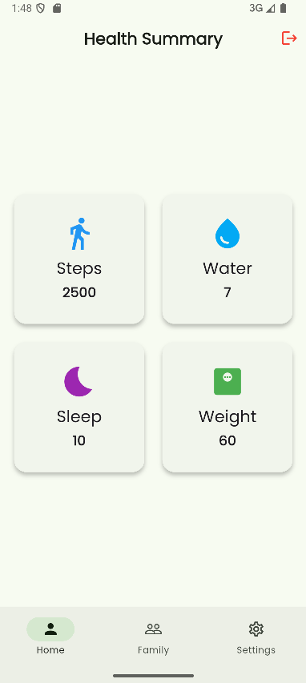

# 💪 Health & Family Metrics App

Welcome to the **Health & Family Metrics App!** This guide walks you through the features of the app—from account creation to tracking your health and your family's progress.

---

## 🚀 Test Accounts

Use these test credentials to log in:

- **Account 1**
  - Email: `rittik@gmail.com`
  - Password: `rittik12`

- **Account 2**
  - Email: `tuli@gmail.com`
  - Password: `tuli12`

---

## 📱 Getting Started

1. Install the app on your device (Android, iOS, or emulator).
2. Open the app to reach the login screen.

---

## 🔐 Authentication

- **Login:** Enter your email and password, then tap **Login**.
- **Sign Up:** Tap "Sign Up" if you don't have an account.
- **Forgot Password:** Tap "Forgot Password?" to reset your password via email.

### Login Screen  


### Sign Up Screen  


### Forgot Password Screen  


---

## 🏠 Home Screen

- View your daily health metrics: **Steps**, **Weight**, **Sleep**, **Water Intake**.
- Tap any metric to view detailed data and add new entries.

### Home Screen  


---

## ➕ Adding & Viewing Metrics

1. Tap a metric card (e.g., Steps).
2. Enter today’s value in the input field.
3. Tap **Save** to store the data.
4. View progress graphs for the selected metric.

### Steps Detail Screen  


### Weight Detail Screen  


---

## 📈 Graphs & Time Ranges

- Choose a time range:
  - **7 days:** Daily values  
  - **15 days:** Daily values with 3 date labels  
  - **1 month:** Weekly averages (1st–4th week)

- **Compare with Family:** Use the dropdown to view data side-by-side with a family member.

### 7-Day Steps Graph  


  


 ### 15-Day Steps Graph


### 1-Month Graph with Comparison 


---

## 👨‍👩‍👧‍👦 Family Management

- **Add Family Member:** Use the Family tab to input member details.
- **View Data:** Monitor each member’s daily health stats.
- **Compare Metrics:** Select a member in any metric screen.

### Family Tab  


### Add Family Member  


### Family Member’s Data  


---

## ⚙️ Settings

- **Edit Profile:** Change your name and email.
- **Reset Password:** Update securely.
- **Logout / Delete Account**
- **App Info:** View version, terms, privacy policy.

### Settings Screen  


### Edit Email Dialog  


### Reset Password Dialog  


---

## 💡 Tips

- **Cloud Sync:** Your data is safely stored and synced across devices.
- **Navigation:** Use the bottom bar to switch between tabs.
- **Troubleshooting:** Check your internet or re-login if errors appear.

---

## 📬 Support

For help, contact the developer or support team.

---

## 🗂 How to Show Images on GitHub

- Place all screenshots in a folder named `screenshots/`
- Reference them like this:
  ```md
  
